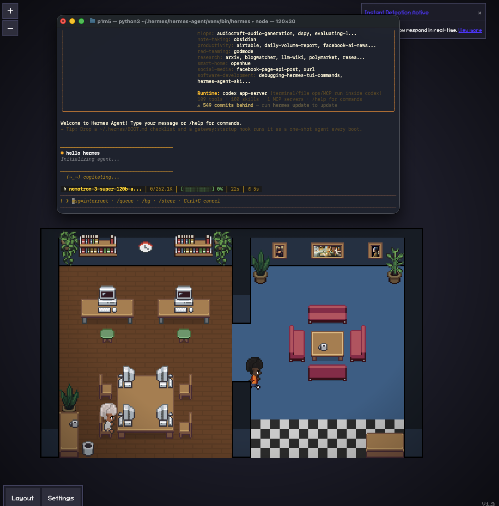

# Hermes × Pixel Agents

**Watch your Hermes agent work, live, as an animated character in a pixel-art office.**



> Hermes (`nemotron-3-super-120b`) running in the TUI on the left while its
> character moves through the office on the right — a teammate already seated at
> the meeting table.

This project makes [NousResearch/hermes-agent](https://github.com/NousResearch/hermes-agent)
show up inside the [Pixel Agents](https://github.com/pixel-agents-hq/pixel-agents)
office UI: every Hermes session becomes a character that types when it writes,
reads when it searches, spawns **teammates** when it delegates subagents, and
raises a "waiting" bubble when a turn ends. Hermes and Claude Code can run in the
**same office at the same time**.

> **About** — A bridge between Hermes (a self-improving Python agent) and Pixel
> Agents (a "watch your AI agents like The Sims" UI). Hermes wasn't supported by
> Pixel Agents — it has no transcript file and runs concurrent tools + real
> subagents. This adds a push-based Hermes provider so you can run `hermes` and
> literally see which agent is doing what, in real time, in the browser.

---

## How it works

```
Hermes  (pixel_observer plugin)                 Pixel Agents server (standalone)
  hooks: session / tool / subagent  ──HTTP──▶   POST /api/hooks/hermes  (Bearer token)
  reads ~/.pixel-agents/server.json             └─▶ HermesBridge ─▶ AgentStateStore
  for {port, token}; fire-and-forget                 └─▶ WebSocket ─▶ office UI
```

- **No Hermes core changes.** The Hermes side is a normal plugin that registers
  lifecycle hooks (`pre_tool_call`, `subagent_start`, `post_llm_call`, …) and
  forwards them. It works for every Hermes frontend — CLI, TUI, gateway — not
  just ACP.
- **No new Pixel Agents protocol.** `HermesBridge` writes the **existing**
  `AgentStateStore`, emitting the same WebSocket messages the webview already
  renders. It shares that store with the Claude runtime, so agent ids never
  collide and both providers appear in one office.
- **Subagents = teammates.** A Hermes subagent is a real session with its own
  tool stream, so it's drawn as a separate teammate character (palette inherited
  from its parent), not as a sub-tool under the parent.

Why a dedicated bridge instead of reusing the Claude hook path: Pixel Agents'
`HookEventHandler` correlates tools through a single id (can't represent Hermes'
**concurrent** tools), gates subagents behind a team provider, and creates agents
only from JSONL transcript files (Hermes has none). The bridge sidesteps all
three while reusing everything downstream of the store.

---

## Repository layout

```
pixel-agents/                 # Pixel Agents fork (runnable) with the Hermes bridge
  server/src/hermesBridge.ts          # ★ event → office translation (the core)
  server/src/providers/hermes/        # ★ Hermes tool metadata + status formatting
  server/__tests__/hermesBridge.test.ts  # ★ bridge unit tests (11 cases)
  server/src/cli.ts                   # routes providerId === 'hermes' to the bridge
  server/src/clientMessageHandler.ts  # unions Hermes tool capabilities into the UI
  server/src/fileWatcher.ts           # guards Claude scanners from despawning Hermes
  server/src/providers/index.ts       # registers hermesProvider
hermes-plugin/
  pixel_observer/               # ★ the Hermes plugin (copy into ~/.hermes/plugins/)
```

★ = files authored for this integration. Everything else under `pixel-agents/`
is upstream. The upstream `hermes-agent` clone is intentionally **not** committed
(it's public and was 601 commits behind); only the plugin lives here.

---

## Setup

### 1. Run the office (standalone web — no VS Code needed)

```sh
cd pixel-agents
npm install && (cd webview-ui && npm install) && (cd server && npm install)
npm run build
node dist/cli.js --port 3100
```

Open **http://127.0.0.1:3100** — an empty office.

Startup writes `~/.pixel-agents/server.json` (port + auth token) and installs
Claude Code hooks into `~/.claude/settings.json` so Claude sessions show up too.
Turn that off in the UI's Settings if you only want Hermes.

### 2. Install + enable the Hermes plugin

Copy the plugin into your Hermes user-plugins directory, then enable it:

```sh
cp -r hermes-plugin/pixel_observer ~/.hermes/plugins/
hermes plugins enable pixel_observer      # takes effect on the next session
```

> Plugin discovery uses `~/.hermes/plugins/` (your real Hermes install), so this
> works without touching the Hermes package. Override the target with
> `PIXEL_AGENTS_URL` / `PIXEL_AGENTS_TOKEN` if the server isn't on the default
> localhost discovery path.

### 3. Run Hermes

```sh
hermes        # or the TUI / gateway
```

Start a session and send a message — a character appears in the office and
animates as Hermes uses tools and delegates subagents.

---

## Test

```sh
cd pixel-agents && npm run test:server   # full suite, incl. hermesBridge.test.ts
```

The bridge is also verified end-to-end against a live server (HTTP route + bearer
auth + WebSocket), and the plugin is confirmed to load via Hermes' real
`PluginManager`.

---

## Credits

- [NousResearch/hermes-agent](https://github.com/NousResearch/hermes-agent) (MIT)
- [pixel-agents-hq/pixel-agents](https://github.com/pixel-agents-hq/pixel-agents)

This repository is an integration layer over those two projects.

Made by **AI UNLOCKED**.
