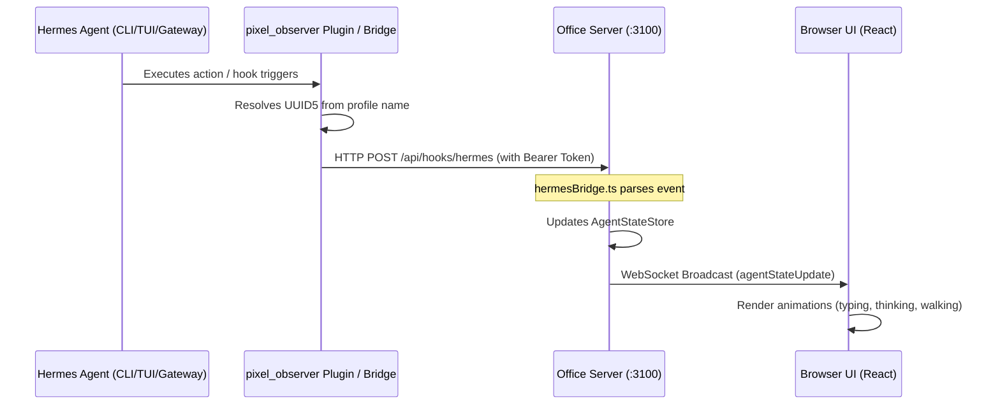

# 🏗️ Pixel Agent Office for Hermes — Architecture Documentation

This document describes the architectural design and event flow of the Hermes Integration with Pixel Agents.

---

## 1. High-Level Event Flow

The system operates on a push-based model where events generated by the Hermes Agent execution are sent to a local or remote Pixel Agents Office server.

---

## 2. Agent Mapping & Identity (UUID5)

To maintain consistent character states across sessions without overlapping with existing Claude Code agents, the system maps Hermes sessions as follows:

*   **Identity Generation**: The server generates a unique UUIDv5 for the character using the Hermes profile name as the name input and a predefined DNS namespace.
    *   *Formula*: `uuid5(NAMESPACE_DNS, profile_name)`
*   **Characters Mapping**:
    *   `trader` profile → Renders as the `trader` character sprite.
    *   `coder` profile → Renders as the `coder` character sprite.
    *   `default` profile → Renders as the `default` (or Telegram) sprite.
*   **Subagents (Teammates)**: When Hermes spawns a subagent, the subagent gets its own unique character (UUIDv5 derived from its subagent session ID) and inherits the parent agent's palette/design but operates as a separate teammate in the room.

---

## 3. Server-Side Components

The integration introduces three core architectural components inside the `pixel-agents` server:

1.  **`hermesBridge.ts`**:
    *   Acts as the translation layer. It receives the custom Hermes hook JSON payloads and maps them to standard Pixel Agent states (e.g., `running_tool`, `thinking`, `idle`).
2.  **`AgentStateStore` Integration**:
    *   Directly inserts or updates agent states into the shared global memory store. This ensures Hermes agents and Claude Code agents can coexist in the same virtual office.
3.  **WebSocket Broadcast**:
    *   Pushes state updates in real-time to any connected React frontend clients (`webview-ui`).

---

## 4. Plugin vs. Python Bridge Comparison

| Feature | Plugin (`pixel_observer`) | Python Bridge (`pixel_agents_bridge.py`) |
| :--- | :--- | :--- |
| **Execution** | Hook registered inside Python runtime | Shell hooks executed by Hermes executor |
| **Setup** | Copied to `~/.hermes/plugins/` | Copied to `~/.hermes/` |
| **Triggers** | Every session event (granular) | Shell execution stages |
| **Pros** | Highly detailed tool & LLM events | Simple, reliable, zero plugin dependencies |
| **Cons** | Requires Gateway restart to load | Misses highly granular internal steps |
| **Best For** | CLI/TUI interactive sessions | Telegram Gateway/Cron jobs |

---

## 5. Persistent Services (Systemd)

To ensure the office web portal is always available, the server is configured as a systemd service (`pixel-office.service`):

*   **Automatic Restart**: Restarts automatically if Node crashes.
*   **Log Redirection**: Directs stdout/stderr to `/root/pixel-office.log`.
*   **Dynamic Port Routing**: Defaults to port `3100` (listening on all interfaces `0.0.0.0` or configurable via `.env`).
